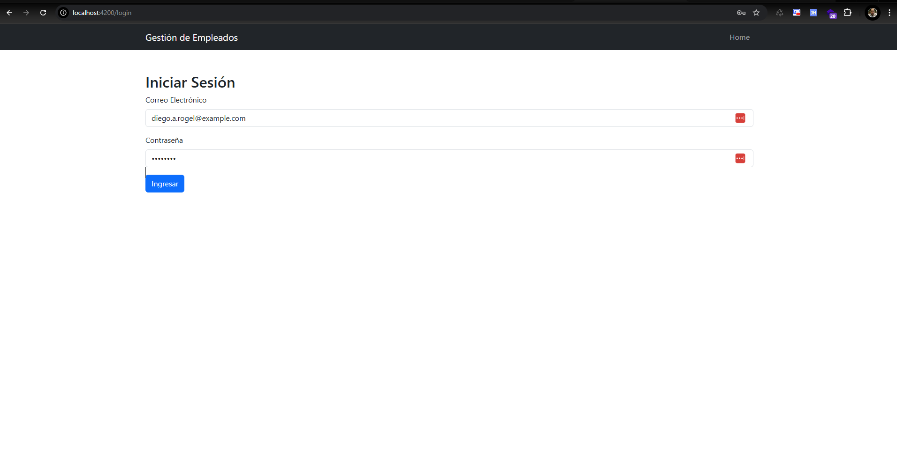
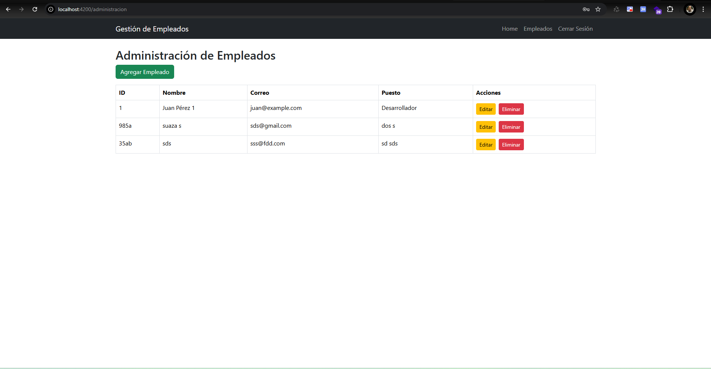
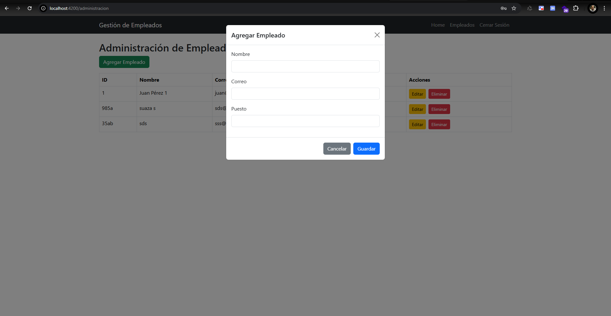
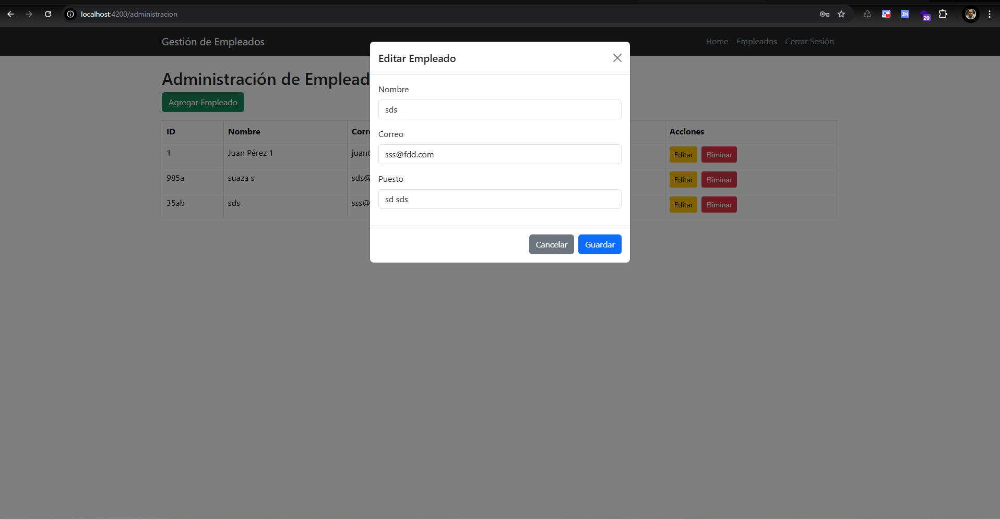
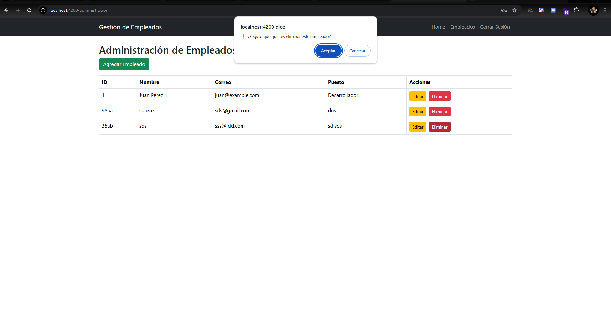

# GestionEmpleados

This project was generated using [Angular CLI](https://github.com/angular/angular-cli) version 19.1.5.

## Development server

To start a local development server, run:

```bash
ng serve
```

Once the server is running, open your browser and navigate to `http://localhost:4200/`. The application will automatically reload whenever you modify any of the source files.

## Code scaffolding

Angular CLI includes powerful code scaffolding tools. To generate a new component, run:

```bash
ng generate component component-name
```

For a complete list of available schematics (such as `components`, `directives`, or `pipes`), run:

```bash
ng generate --help
```

## Building

To build the project run:

```bash
ng build
```

This will compile your project and store the build artifacts in the `dist/` directory. By default, the production build optimizes your application for performance and speed.

## Running unit tests

To execute unit tests with the [Karma](https://karma-runner.github.io) test runner, use the following command:

```bash
ng test
```

## Running end-to-end tests

For end-to-end (e2e) testing, run:

```bash
ng e2e
```

Angular CLI does not come with an end-to-end testing framework by default. You can choose one that suits your needs.

## Additional Resources

For more information on using the Angular CLI, including detailed command references, visit the [Angular CLI Overview and Command Reference](https://angular.dev/tools/cli) page.

# Aplicativo Móvil: Gestión de Empleados

## Especificaciones

### 1. Interfaz de usuario con navegación mediante enrutamiento:
- **Página de inicio con descripción de la aplicación.**:
- **Página de 'Gestión de Empleados' para mostrar datos desde una API.**:
- **Página de 'Administración' para agregar, editar y eliminar empleados.**:
- **Página de 'Error 404' en caso de acceder a rutas no definidas.**:

---

### 2. Consumo de API REST
- **GET:** Obtener lista de empleados
- **POST:** Agregar un nuevo empleado.
- **PUT:** Editar un empleado existente.
- **DELETE:** Eliminar un empleado.

---

### 3. Manejo de formularios y validaciones:
- Validación de campos obligatorios.
- Validación de formato de correo electrónico.
- Confirmación de contraseña.

---

### 4. Protección de rutas mediante guardianes (guards).
- Es libre de usar cualquier librería de CSS o generar tus propios estilos personalizados.
---

### 5. Ejecución
- En un consola ejecutar:  json-server --watch db.json --port 3000
- En otra consola ejecutar: ng serve --open
- Para el admin. Usuario: diego.a.rogel@example.com Clave: admin123
---

### 6. Capturas de Pantalla
- Es libre de usar cualquier librería de CSS o generar tus propios estilos personalizados.
- **Screen 1: Homes**
  

- **Screen 2: Lista de Empleados**
  

- **Screen 3: Login**
  

- **Screen 4: Administración Empleado**
  

- **Screen 5: Agregar Empleado**
  

- **Screen 6: Editar**
  

- **Screen 7: Eliminar**
  